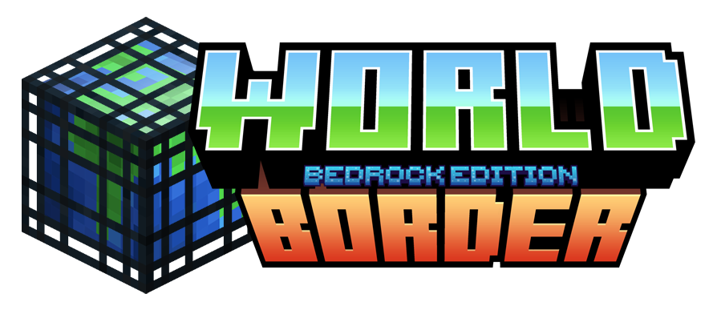

# BedrockWorldBorder

[](CHANGELOG.md)
[](https://www.minecraft.net)
[](https://learn.microsoft.com/minecraft/creator/)

A professional world border addon for Minecraft Bedrock Edition that brings Java Edition-style borders with extensive customization. Set boundaries for your Overworld, Nether, and End with stunning animated particle walls, flexible enforcement options, and comprehensive interaction control.

## ✨ Features

- **11 Customizable Border Styles**: Choose from beautiful animated particle styles to match your server's aesthetic
- **Java Edition Parity**: Authentic 192-block tall animated walls just like Java Edition
- **Interaction Prevention**: Stop players from breaking, placing, or interacting with blocks outside borders
- **Per-Dimension Configuration**: Independent settings for Overworld, Nether, and End
- **Flexible Enforcement**: Choose between smooth teleportation or physics-based knockback
- **Custom Border Centers**: Place borders anywhere in the world, not just at spawn
- **In-Game GUI**: User-friendly configuration interface with custom dimension icons
- **No Beta APIs Required**: Built on stable Minecraft APIs for maximum compatibility

## 📋 Requirements

- **Minecraft Bedrock Edition**: 1.21.50 or higher
- **Game Version**: Latest stable release recommended
- **Permissions**: Game Director level (2+) for administration
- **No Experiments Required**: Works with stable APIs only

## 📦 Installation

### Single Player / Realm Owner

1. Download the latest release `.mcpack` files (both Behavior and Resource packs)
2. Double-click each `.mcpack` file to import into Minecraft
3. Create a new world or edit an existing world
4. Navigate to the "Behavior Packs" section
5. Activate "BedrockWorldBorder BP"
6. Navigate to the "Resource Packs" section
7. Activate "BedrockWorldBorder RP"
8. Start your world!

### Dedicated Servers

1. Download and extract the addon files
2. Place `BedrockWorldBorder_BP` in your server's `behavior_packs` folder
3. Place `BedrockWorldBorder_RP` in your server's `resource_packs` folder
4. Add both packs to your world's `world_behavior_packs.json` and `world_resource_packs.json`
5. Restart the server

### Realms

1. Import both packs following the Single Player steps
2. Upload your configured world to your Realm
3. Settings will be preserved automatically

## 🚀 Quick Start

### First Time Setup

1. Join your world with operator permissions (Game Director level)
2. Run `/worldborder:menu` to open the settings interface
3. Select the dimension you want to configure (Overworld, Nether, or End)
4. Configure your border:
   - **Enable Border**: Toggle on to activate
   - **Distance from Center**: Set how many chunks (16 blocks each) from center
   - **Border Style**: Choose from 11 visual styles
   - **Enforcement Action**: Pick teleport or knockback
   - **Custom Center**: Set X,Z coordinates (or leave at 0,0)
   - **Interaction Prevention**: Toggle to prevent block manipulation outside border

5. Save and test your border!

### Recommended Settings

**Survival Servers:**
- Distance: 625 chunks (10,000 blocks)
- Style: Default or Style 1
- Action: Teleport
- Interaction Prevention: On

**Creative/Build Servers:**
- Distance: 312 chunks (5,000 blocks)
- Style: Match your theme
- Action: Knockback (less disruptive)
- Interaction Prevention: Off

**Minigame Arenas:**
- Distance: 31-62 chunks (500-1,000 blocks)
- Style: Style 9 or 10 (dramatic)
- Action: Knockback
- Interaction Prevention: On

## 📖 Commands Reference

### Player Commands

| Command | Description | Permission |
|---------|-------------|------------|
| `/worldborder:help` | Display command help | Everyone |
| `/worldborder:status` | Show current border settings for all dimensions | Everyone |

### Admin Commands

| Command | Description | Example |
|---------|-------------|---------|
| `/worldborder:menu` | Open GUI settings (recommended) | `/worldborder:menu` |
| `/worldborder:size <dimension> <chunks>` | Set border distance from center | `/worldborder:size overworld 625` |
| `/worldborder:center <dimension> <x> <z>` | Set custom center point | `/worldborder:center nether 500 -500` |
| `/worldborder:allow <player> <on\|off>` | Grant/revoke border bypass | `/worldborder:allow Steve on` |

**Dimension Values**: `overworld`, `nether`, `end`, or `all`

## 🎨 Border Styles

Choose from 11 beautiful animated particle styles:

| Style | Description | Best For |
|-------|-------------|----------|
| Default | Classic blue animated wall | General use, Java Edition feel |
| Style 1 | Vibrant red energy | Nether borders, warning zones |
| Style 2 | Electric purple | End dimension, mystical themes |
| Style 3 | Golden shimmer | Prestigious areas, spawn protection |
| Style 4 | Green nature | Forest biomes, natural boundaries |
| Style 5 | Ice blue | Snowy biomes, frozen regions |
| Style 6 | Fire orange | Desert borders, lava zones |
| Style 7 | Deep ocean | Water boundaries, ocean limits |
| Style 8 | Dark void | End dimension, mysterious areas |
| Style 9 | Cyan tech | Modern builds, sci-fi themes |
| Style 10 | Pink magic | Fantasy builds, enchanted areas |

Each style features smooth 16 FPS animations and 192-block height for maximum visibility.

## ⚙️ Configuration Options

### Per-Dimension Settings

| Setting | Type | Default | Description |
|---------|------|---------|-------------|
| **Enabled** | Toggle | On | Activate border for this dimension |
| **Distance from Center** | Number | 62 chunks | Radius from center point (in chunks) |
| **Center X** | Number | 0 | X-coordinate of border center |
| **Center Z** | Number | 0 | Z-coordinate of border center |
| **Border Style** | Dropdown | Default | Visual appearance (11 options) |
| **Enforcement Action** | Dropdown | Teleport | How to handle border crossing |
| **Warning Distance** | Number | 50 blocks | When to show distance warnings |
| **Show Warnings** | Toggle | On | Display warning messages |
| **Show Particles** | Toggle | On | Render particle walls |
| **Prevent Interaction** | Toggle | Off | Block manipulation prevention |

### Global Settings

- **Admin Bypass**: Admins with Game Director level automatically get special notifications
- **Tag-Based Bypass**: Players with `border_bypass` tag can cross borders freely
- **Permission Levels**: Game Director (level 2+) required for admin commands

## 🛡️ Interaction Prevention

The interaction prevention system (new in v3.0.0) gives you granular control over player actions outside borders:

### What It Prevents

1. **Block Breaking**: Players cannot mine or destroy blocks
2. **Block Placing**: Blocks cannot be placed (automatically returned to player)
3. **Block Interaction**: Chests, doors, buttons, levers, and other interactive blocks are locked

### Permission Respect

- **Admins**: Game Directors can always interact
- **Bypass Players**: Those with `border_bypass` tag are exempt
- **Regular Players**: Fully restricted outside borders

### Configuration

Toggle independently for each dimension through the GUI or commands. Perfect for protecting wilderness areas while allowing building near spawn.

## 🔐 Permission System

### Permission Levels

| Level | Description | Abilities |
|-------|-------------|-----------|
| **Player** | Default players | Affected by all border restrictions |
| **Game Director** | Admin level (2+) | Can configure borders, sees special "Beyond border" warnings |
| **Bypass** | Has `border_bypass` tag | Can cross borders freely, exempt from restrictions |

### Granting Bypass Permission

**Using Commands:**
```
/worldborder:allow PlayerName on
```

**Using Tags Manually:**
```
/tag PlayerName add border_bypass
```

## 🎯 How Borders Work

### Visual Feedback System

1. **Far Away** (>50 blocks): No warnings, normal gameplay
2. **Approaching** (50-10 blocks): Distance warnings in chat/action bar
3. **At Border** (10-0 blocks): Particle walls become visible
4. **Beyond Border** (<0 blocks): Enforcement action triggered

### Enforcement Actions

**Teleport Mode** (Default):
- Smoothly returns player to safe position inside border
- Preserves camera view direction (no jarring snap)
- Intelligent Y-level detection prevents suffocation
- Sound and visual feedback for clarity

**Knockback Mode**:
- Physics-based pushback toward center
- Maintains momentum for natural feel
- Dramatic sound effects
- Perfect for minigames and arenas

## 🔧 Troubleshooting

### Commands Not Working

**Issue**: Commands don't respond or show "unknown command"

**Solutions**:
- Verify you have Game Director permissions: `/testfor @s[lm=2]`
- Use full command with colon: `/worldborder:menu` not `/worldborder menu`
- Check addon is enabled in world settings
- Restart world if recently enabled

### No Particle Walls Visible

**Issue**: Can't see border particles

**Solutions**:
- Border must be enabled for your dimension (check with `/worldborder:status`)
- Get within 6 chunks (96 blocks) of border edge
- Verify "Show Particles" is enabled in dimension settings
- Check particle render distance in video settings
- Ensure Resource Pack is active

### Border Not Enforcing

**Issue**: Players can cross border without being stopped

**Solutions**:
- Confirm border is enabled: `/worldborder:status`
- Check player doesn't have bypass permission
- Verify distance setting is correct (not 0)
- Look for "Loaded successfully!" message in chat when joining
- Admin/Game Director? You get warnings instead of enforcement

### Interaction Prevention Not Working

**Issue**: Players can still break/place blocks outside border

**Solutions**:
- Toggle must be enabled in dimension settings
- Check player doesn't have bypass tag
- Verify player isn't admin level
- Try disabling and re-enabling the feature

### Performance Issues

**Issue**: Server lag or stuttering

**Solutions**:
- Reduce border sizes for multiple dimensions
- Disable particles temporarily: Set "Show Particles" to off
- Increase warning distance check interval in constants.js
- Consider using fewer active dimensions

## 📊 Default Configuration

| Setting | Overworld | Nether | End |
|---------|-----------|--------|-----|
| Enabled | Yes | Yes | Yes |
| Distance | 62 chunks (992 blocks) | 62 chunks | 62 chunks |
| Center | 0, 0 | 0, 0 | 0, 0 |
| Style | Default | Default | Default |
| Action | Teleport | Teleport | Teleport |
| Warnings | On (50 blocks) | On (50 blocks) | On (50 blocks) |
| Particles | On | On | On |
| Prevent Interaction | Off | Off | Off |

## 🆙 Upgrading from v2.x

Version 3.0.0 is fully backward compatible with v2.x configurations:

1. **Backup your world** (always recommended!)
2. Remove old addon files
3. Install new v3.0.0 files (both behavior and resource packs)
4. Reload world or restart server
5. Existing borders continue working with saved settings
6. New features (styles, interaction prevention) are **disabled by default**
7. Configure new features through `/worldborder:menu` at your own pace

**What's Preserved:**
- Border sizes and centers
- Enabled/disabled states
- Warning distances and toggles
- Enforcement action choices
- Bypass permissions

**What's New:**
- Border style selection (defaults to "Default" style)
- Interaction prevention (defaults to Off)
- Improved teleportation (view direction preserved automatically)

## 📚 Additional Documentation

- [CHANGELOG.md](CHANGELOG.md) - Complete version history and release notes
- [ABOUT.md](ABOUT.md) - Comprehensive addon information and philosophy
- [announcement_v3.0.0.md](announcement_v3.0.0.md) - What's new in version 3.0.0

## 🐛 Bug Reports & Feature Requests

Found a bug or have a suggestion? We'd love to hear from you!

**When reporting bugs, please include:**
1. Minecraft Bedrock Edition version
2. Addon version (3.0.0)
3. Platform (Windows, Xbox, PlayStation, Mobile, etc.)
4. Detailed steps to reproduce the issue
5. Screenshots or video if applicable
6. Any error messages from content log

**Report issues via:**
- GitHub Issues (preferred)
- Discord community server
- Direct message to addon author

## 🤝 Contributing

Contributions are welcome! If you'd like to improve BedrockWorldBorder:

1. Fork the repository
2. Create a feature branch
3. Make your changes with clear commit messages
4. Test thoroughly on multiple platforms
5. Submit a pull request with detailed description

**Areas we'd love help with:**
- Additional particle style designs
- Performance optimizations
- Translation/localization
- Documentation improvements
- Bug fixes and testing

## 📄 License

This addon is released under the **Creative Commons Attribution-NonCommercial-ShareAlike 4.0 International License** (CC BY-NC-SA 4.0).

**You are free to:**
- ✅ Share and redistribute
- ✅ Adapt and build upon
- ✅ Use on servers and realms

**Under these terms:**
- 📝 Give appropriate credit
- 🚫 No commercial use
- 🔄 Share adaptations under same license

## 👤 Author & Acknowledgments

**Created by**: [Your Name]

**Special Thanks:**
- Minecraft Bedrock community for feature suggestions
- Beta testers who helped refine v3.0.0
- Contributors who reported bugs and provided feedback

**Built with:**
- @minecraft/server 2.3.0 (stable API)
- @minecraft/server-ui 2.1.0 (stable API)
- Love for the Bedrock community ❤️

---

**Current Version**: 3.0.0 | **Released**: January 27, 2025

**Compatibility**: Minecraft Bedrock Edition 1.21.50+ | Stable APIs Only

🌎 **Bring professional world borders to your Bedrock world today!** 🌎
